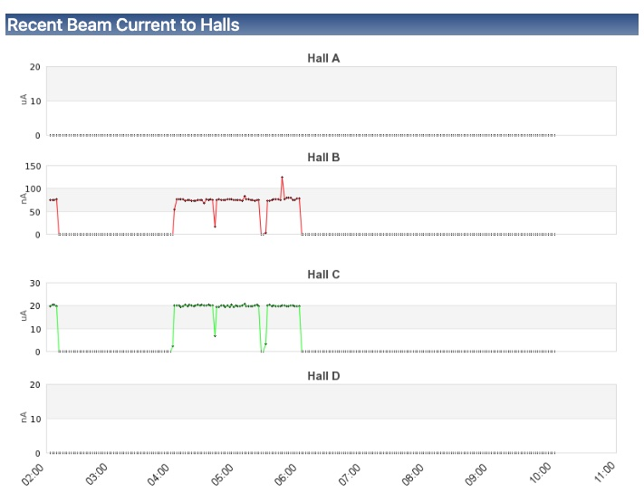
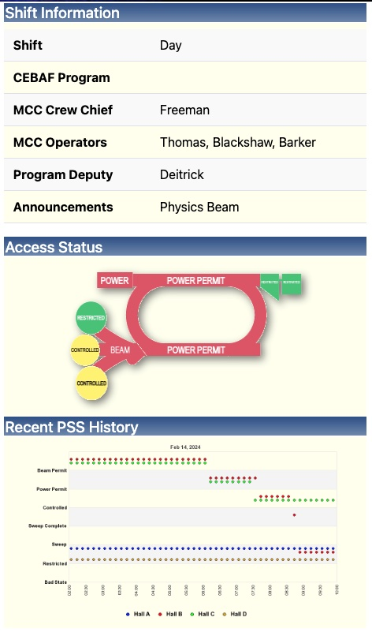

# CEBAF Status Module

This module provides programmatically generated content for
the [cebaf web server](https://cebaf.jlab.org/) along with several
Drupal blocks for presenting the dynamic information.

## Blocks
The module provides three sidebar content blocks and one block for the main content
area.  They are illustrated below.

Main Area Blocks             |  Sidebar Blocks
:-------------------------:|:-------------------------:
  |  

The blocks are enabled and positioned from the Drupal [Block Layout Page](https://cebaf.jlab.org//admin/structure/block)

## Dependencies
The module relies on access to [web-based caget](https://epicsweb.jlab.org/epics2web/caget) via an epics2web server.
The URL to configure which epicsweb server is used is configurable from the
[module configuration page](https://cebaf.jlab.org/admin/config/cebaf_status/settings)

## See Also

The AboutCebafweb9 topic in the ACE wiki has additional server-specific configuration details.

