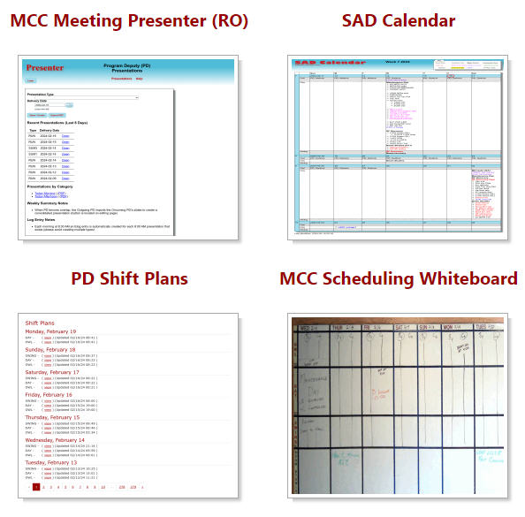

# CEBAF Status Module

This module provides programmatically generated content for
the [cebaf web server](https://cebaf.jlab.org/) along with several
Drupal blocks for presenting the dynamic information.

## Blocks
The module provides three sidebar content blocks and one block for the main content
area.  They are illustrated below.

|       Main Area Blocks       |  Sidebar Blocks |
|:----------------------------:|:-------------------------:|
|   |  |

The blocks are enabled and positioned from the Drupal [Block Layout Page](https://cebaf.jlab.org//admin/structure/block)

## Thumbnails
The module maintains the library of thumbnail images that are used on
[some of the cebaf pages](https://cebaf.jlab.org/schedules_planning).  This is done by providing a Drupal
QueueWorker plugin which gets invoked via the Drupal cron mechanism.  When invoked, it creates new thumbnails
that (mostly) reflect the current status of the various pertinent web pages.

## Dependencies
For EPICS PV values, the module relies on access to [web-based caget](https://epicsweb.jlab.org/epics2web/caget)
via an epics2web server. The URL to configure which epicsweb server is used is configurable from the
[module configuration page](https://cebaf.jlab.org/admin/config/cebaf_status/settings)

To make snapshots of the web pages shown as thumbnails, the module relies on access to the ACE
puppet-show server.

## See Also

The AboutCebafweb9 topic in the ACE wiki has additional server-specific configuration details.

